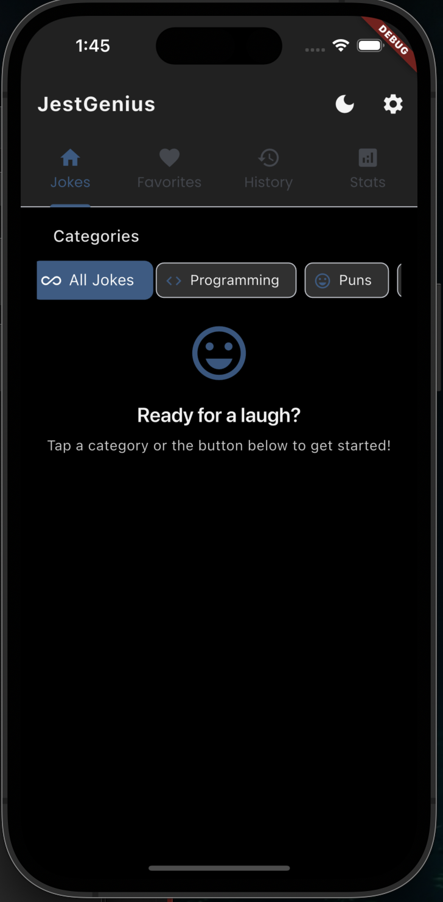
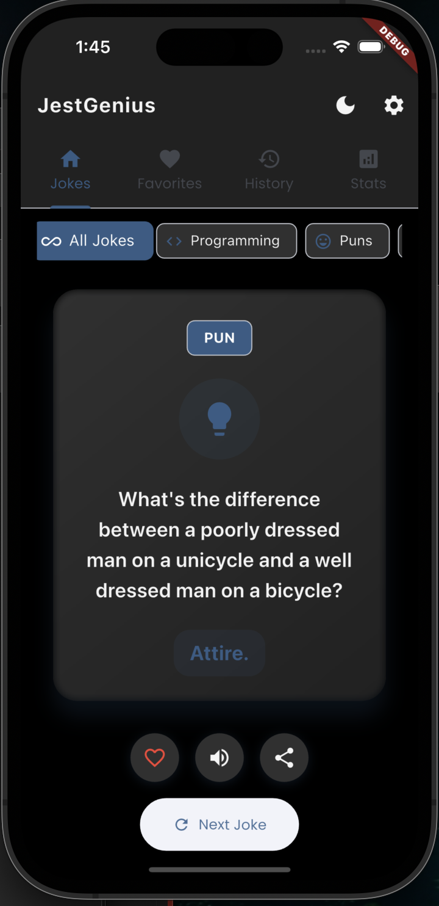
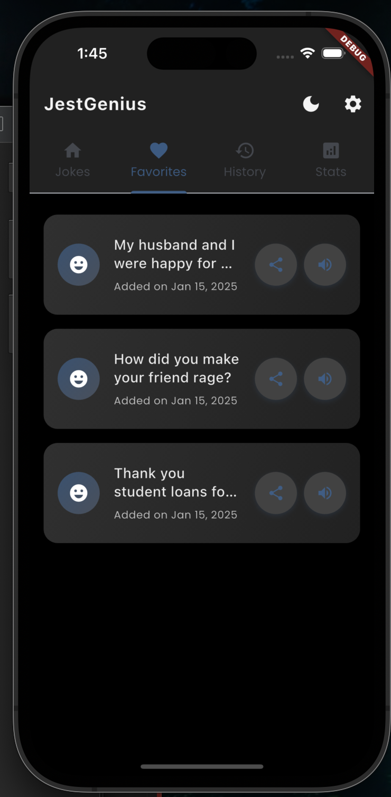
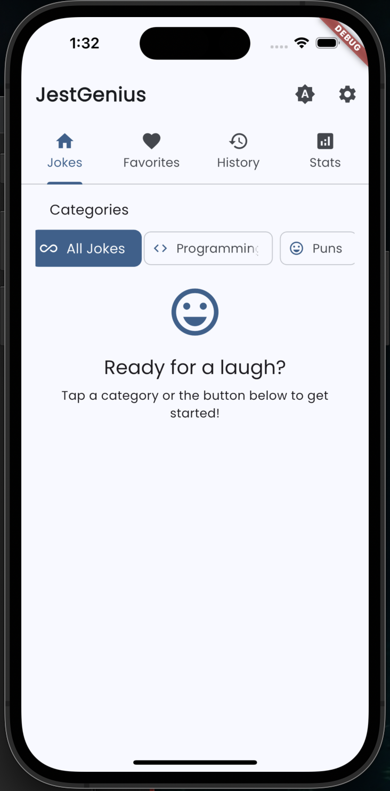
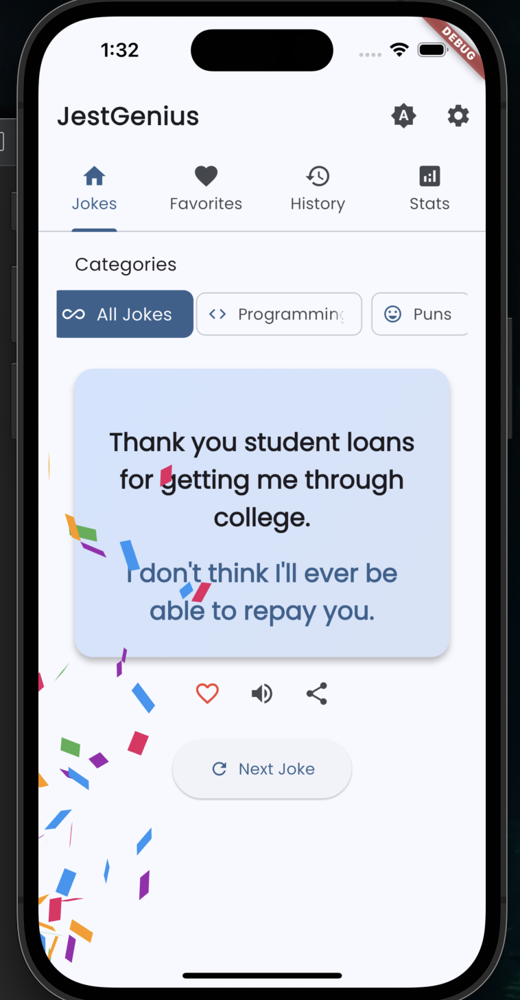
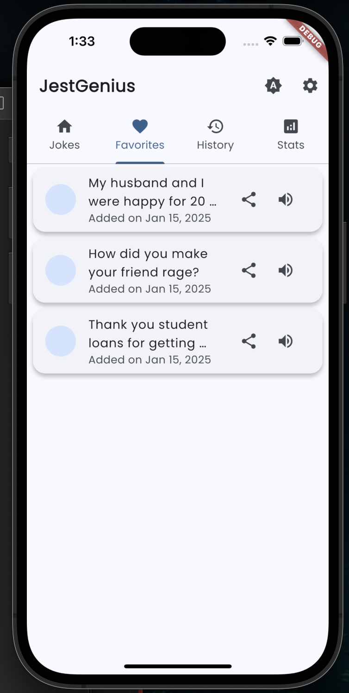
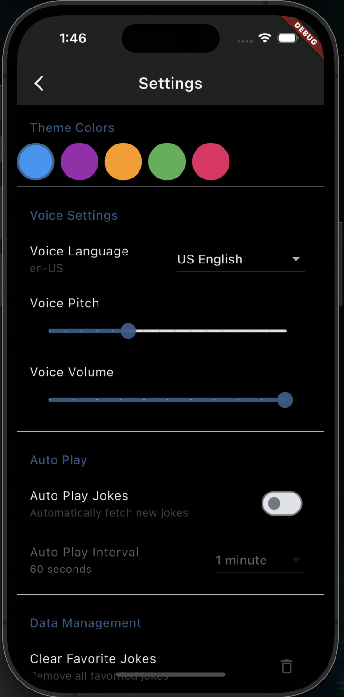
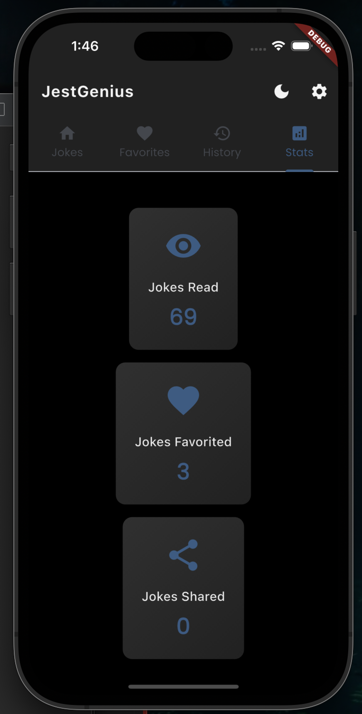

# JestGenius - Advanced Joke Generator

JestGenius is a modern, feature-rich joke generator application built with Flutter that delivers a diverse collection of jokes across multiple categories with a beautiful, intuitive interface.

## Features

### Core Features
- 🎯 Multiple joke categories including:
  - Programming Jokes
  - Puns
  - Dad Jokes
  - Chuck Norris Jokes
  - Misc Jokes
  - Dark Humor (Safe Mode)
  - Christmas Jokes
  - Spooky Jokes

### User Experience
- 🌓 Dynamic Theme Switching (Light/Dark/System)
- 🎨 Customizable Color Schemes
- 🎉 Celebration Animations
- ⚡ Offline Support
- 💾 Joke History
- ❤️ Favorites System
- 📊 Statistics Tracking

### Advanced Features
- 🗣️ Text-to-Speech with:
  - Multiple Voice Options
  - Adjustable Pitch
  - Volume Control
  - Voice Queue System
- 🔄 Auto-Play Functionality
- 📱 Share Jokes
- 📬 Daily Joke Notifications

### Technical Features
- 💽 Local Storage for Favorites & History
- 🌐 Multiple API Integration
- 🔒 Error Handling & Connectivity Checks
- 📱 Responsive Design
- 🎨 Material Design 3.0
- ✨ Smooth Animations

## Dependencies

- provider: ^6.0.5 (State Management)
- http: ^1.1.0 (Network Requests)
- shared_preferences: ^2.2.1 (Local Storage)
- flutter_tts: ^3.8.3 (Text-to-Speech)
- confetti: ^0.7.0 (Animations)
- google_fonts: ^5.1.0 (Typography)
- And more...

## APIs Used

- JokeAPI.dev
- icanhazdadjoke.com
- api.chucknorris.io

## Architecture

The app follows a clean architecture pattern with:
- Provider for state management
- Model-View architecture
- Service-based API integration
- Local storage management

## Contributing

1. Fork the repository
2. Create your feature branch (`git checkout -b feature/AmazingFeature`)
3. Commit your changes (`git commit -m 'Add some AmazingFeature'`)
4. Push to the branch (`git push origin feature/AmazingFeature`)
5. Open a Pull Request

## Screenshots

### Dark Mode

  
  
  

### Light Mode

  
  
  

### Features

  
  
  

### Key UI Features Shown:
- 🌓 Dynamic Theme Switching
- 🎨 Beautiful Card Designs
- 📱 Responsive Layout
- 🎯 Category Selection
- ⚙️ Customizable Settings
- 📊 Statistics Dashboard

## Future Enhancements

- [ ] Add more joke categories
- [ ] Implement joke rating system
- [ ] Add social features
- [ ] Create joke collections/playlists
- [ ] Add achievements system
- [ ] Implement machine learning for joke recommendations

